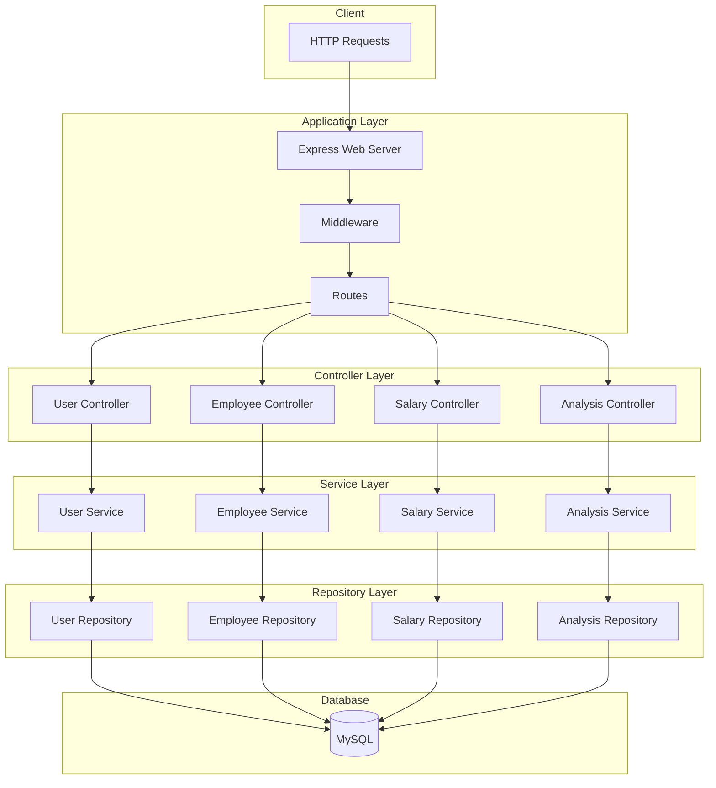

# HashMicro Technical Test - Node.js MVC Application

<p align="center">
  
  
  
  
  
  
</p>

## Overview

Aplikasi web-based menggunakan **TypeScript + Express.js** dengan arsitektur MVC, menerapkan prinsip OOP dan Design Pattern. Aplikasi ini memenuhi semua requirements teknis yang dibutuhkan.

## Tech Stack

| Technology | Purpose |
|------------|---------|
| Node.js + TypeScript | Runtime & Language |
| Express.js | Web Framework (MVC) |
| Prisma ORM | Database ORM |
| MySQL 8.0 | Database |
| Zod | Validation |
| bcrypt | Password Hashing |
| Winston | Logging |
| Jest | Testing |
| Nginx | Reverse Proxy |

---

## Table of Contents

- [Quick Start - NPM](#quick-start---npm)
- [Quick Start - Docker](#quick-start---docker)
- [Testing](#testing)
- [Docker Setup](#docker-setup)
- [API Documentation](#api-documentation)
- [Project Structure](#project-structure)
- [Environment Variables](#environment-variables)

---

## Quick Start - NPM

### Prerequisites

- Node.js >= 18
- MySQL >= 8.0 (running locally)

### Steps

```bash
# 1. Install dependencies
npm install

# 2. Copy environment file (edit if needed)
cp .env.example .env

# 3. Setup database (ensure MySQL is running)
npx prisma migrate dev

# 4. Generate Prisma client
npx prisma generate

# 5. Type check
npm run typecheck

# 6. Build
npm run build

# 7. Run tests (unit tests only - no database required)
npm run test

# 8. Run development server
npm run dev
```

---

## Quick Start - Docker

### Prerequisites

- Docker
- Docker Compose

### Steps

```bash
# 1. Build and start all services
docker compose up --build -d

# 2. Verify all containers are running
docker compose ps

# 3. Check health
curl http://localhost/health

# 4. Run tests inside container
docker compose exec app npm run test

# 5. Stop all services
docker compose down
```

---

## Testing

### NPM Commands

| Command | Description |
|---------|-------------|
| `npm run test` | Run unit tests only (no database required) |
| `npm run test:all` | Run all tests including API tests (requires database) |
| `npm run typecheck` | Type check with TypeScript |
| `npm run build` | Build TypeScript to JavaScript |

### Testing Flow - Docker

```bash
# 1. Stop existing containers
docker compose down -v

# 2. Build and start fresh
docker compose up --build -d

# 3. Wait for services to be healthy
sleep 10

# 4. Test MySQL connection
docker compose exec db mysql -uroot -proot -e "SHOW DATABASES;"

# 5. Test nginx health endpoint
curl http://localhost/health

# 6. Test API registration via nginx
curl -X POST http://localhost/api/users/register \
  -H "Content-Type: application/json" \
  -d '{"username":"admin","password":"admin123","name":"Admin"}'

# 7. Test API login
curl -X POST http://localhost/api/users/login \
  -H "Content-Type: application/json" \
  -d '{"username":"admin","password":"admin123"}'

# 8. Run tests inside container
docker compose exec app npm run test

# 9. View logs
docker compose logs -f app

# 10. Stop services
docker compose down -v
```

---

## Docker Setup

### Architecture

```
┌─────────────────────────────────────────────────────────────┐
│                        Host Machine                        │
│                                                             │
│   ┌──────────┐    ┌─────────────────┐    ┌─────────────┐   │
│   │   curl   │───▶│     Nginx       │───▶│     App     │   │
│   └──────────┘    │   Port: 80      │    │  Port:8081  │   │
│   ┌──────────┐    └─────────────────┘    └──────┬──────┘   │
│   │  MySQL   │◀─────────────────────────────▶│  Prisma   │   │
│   │  Client  │                                │           │   │
│   └──────────┘    ┌─────────────────┐         │           │   │
│                   │   MySQL:8.0     │◀────────┘           │   │
│                   │   Port: 3306    │                     │   │
│                   └─────────────────┘                     │   │
└─────────────────────────────────────────────────────────────┘
```

### Services

| Service | Port (Host) | Internal Port | Description |
|---------|-------------|---------------|-------------|
| nginx | 80 | 80 | Reverse proxy |
| app | - | 8081 | Node.js API |
| db | 3306 | 3306 | MySQL 8.0 |

### Docker Commands

```bash
# Start all services
docker compose up -d

# Start with rebuild
docker compose up --build -d

# View all services status
docker compose ps

# View logs
docker compose logs -f
docker compose logs -f app
docker compose logs -f db
docker compose logs -f nginx

# Stop services (keep data)
docker compose stop

# Stop and remove containers
docker compose down

# Stop and remove containers + volumes (fresh start)
docker compose down -v

# Execute command in container
docker compose exec app sh
docker compose exec db mysql -uroot -proot
```

### Docker Environment Variables

Services use these environment variables:

| Variable | Service | Default | Description |
|----------|---------|---------|-------------|
| `DATABASE_URL` | app | mysql://root:root@db:3306/hashmicro_hiring_test | MySQL connection string |
| `PORT` | app | 8081 | Application port |
| `NODE_ENV` | app | production | Environment mode |
| `MYSQL_ROOT_PASSWORD` | db | root | MySQL root password |
| `MYSQL_DATABASE` | db | hashmicro_hiring_test | Database name |

---

## API Documentation

### Base URL

| Environment | URL |
|-------------|-----|
| Docker (via Nginx) | http://localhost |
| Docker (Direct) | http://localhost:8081 |
| Local (npm run dev) | http://localhost:8081 |

### Swagger UI

| Environment | URL |
|-------------|-----|
| Docker (via Nginx) | http://localhost/api-docs/ |
| Local | http://localhost:8081/api-docs/ |

### Health Check

```bash
# Via Nginx
curl http://localhost/health

# Direct
curl http://localhost:8081/health
```

### Authentication

Semua endpoint yang memerlukan auth harus menyertakan header:

```
X-API-TOKEN: <token_dari_login>
```

### Complete Test Flow (via Nginx)

```bash
# 1. Register
curl -X POST http://localhost/api/users/register \
  -H "Content-Type: application/json" \
  -d '{"username":"admin","password":"admin123","name":"Admin"}'

# 2. Login
curl -X POST http://localhost/api/users/login \
  -H "Content-Type: application/json" \
  -d '{"username":"admin","password":"admin123"}'
# Response contains token

# 3. Set token variable
TOKEN="<token_from_login_response>"

# 4. Create Employee
curl -X POST http://localhost/api/employees \
  -H "X-API-TOKEN: $TOKEN" \
  -H "Content-Type: application/json" \
  -d '{"first_name":"John","last_name":"Doe","email":"john@example.com","phone":"081234567890","salary":15000000,"department":"Engineering","position":"Senior"}'

# 5. List Employees
curl http://localhost/api/employees \
  -H "X-API-TOKEN: $TOKEN"

# 6. Calculate Salary
curl -X POST http://localhost/api/salaries/calculate \
  -H "X-API-TOKEN: $TOKEN" \
  -H "Content-Type: application/json" \
  -d '{"employee_id":1,"period":"2024-01"}'

# 7. Character Analysis (Sensitive - 20%)
curl -X POST http://localhost/api/analysis \
  -H "X-API-TOKEN: $TOKEN" \
  -H "Content-Type: application/json" \
  -d '{"input1":"ABBCD","input2":"Gallant Duck","case_type":"sensitive"}'

# 8. Character Analysis (Insensitive - 60%)
curl -X POST http://localhost/api/analysis \
  -H "X-API-TOKEN: $TOKEN" \
  -H "Content-Type: application/json" \
  -d '{"input1":"ABBCD","input2":"Gallant Duck","case_type":"insensitive"}'
```

---

## Available Scripts

| Script | Description |
|--------|-------------|
| `npm run dev` | Start development server with hot reload |
| `npm run build` | Build TypeScript to JavaScript |
| `npm start` | Start production server |
| `npm run test` | Run unit tests |
| `npm run test:all` | Run all tests (requires database) |
| `npm run typecheck` | Type check with `tsc --noEmit` |
| `npx prisma migrate dev` | Run database migrations |
| `npx prisma db push` | Push schema to database |
| `npx prisma generate` | Generate Prisma client |
| `npx prisma studio` | Open Prisma Studio |

---

## Project Structure

```
src/
├── application/          # App config
│   ├── database.ts       # Singleton PrismaClient
│   ├── logging.ts        # Winston logger
│   ├── swagger.ts        # API Documentation
│   └── web.ts            # Express setup
├── controller/           # MVC Controllers
│   ├── user-controller.ts
│   ├── employee-controller.ts
│   ├── salary-controller.ts
│   └── analysis-controller.ts
├── error/
│   └── response-error.ts # Custom error class
├── middleware/
│   ├── auth-middleware.ts
│   └── error-middleware.ts
├── model/                # OOP Models
│   ├── base-model.ts     # Abstract base class
│   ├── user-model.ts
│   ├── employee-model.ts
│   ├── analysis-model.ts
│   └── page.ts
├── repository/           # Repository Pattern
│   ├── base-repository.ts
│   ├── user-repository.ts
│   ├── employee-repository.ts
│   ├── salary-repository.ts
│   └── analysis-repository.ts
├── service/              # Business logic
│   ├── user-service.ts
│   ├── employee-service.ts
│   ├── salary-service.ts
│   └── analysis-service.ts
├── strategy/             # Strategy Pattern
│   ├── case-strategy.ts
│   ├── sensitive-case.ts
│   ├── insensitive-case.ts
│   └── strategy-factory.ts
├── route/
│   ├── public-api.ts
│   └── api.ts
├── type/
│   └── user-request.ts
├── validation/           # Zod validation
│   ├── validation.ts
│   ├── user-validation.ts
│   ├── employee-validation.ts
│   └── analysis-validation.ts
└── main.ts
```

---

## Environment Variables

### .env

```env
# Database connection (use 'db' for Docker, 'localhost' for local development)
DATABASE_URL="mysql://root:root@db:3306/hashmicro_hiring_test"
PORT=8081
```

### Connection Details

| Setting | Docker | Local |
|---------|--------|-------|
| MySQL Host | `db` | `localhost` |
| MySQL Port | `3306` | `3306` |
| MySQL User | `root` | `root` |
| MySQL Password | `root` | `root` |
| Database Name | `hashmicro_hiring_test` | `hashmicro_hiring_test` |

---

## Architecture



## Design Patterns

| Pattern | Implementation |
|---------|---------------|
| **Inheritance** | `BaseModel` → `UserModel`, `EmployeeModel`, `AnalysisModel` |
| **Repository** | `BaseRepository<T>` → `UserRepository`, `EmployeeRepository`, dll |
| **Strategy** | `CaseStrategy` → `SensitiveCaseStrategy`, `InsensitiveCaseStrategy` |
| **Factory** | `StrategyFactory` untuk create strategy berdasarkan case type |
| **Singleton** | `Database` class untuk PrismaClient instance |

## Requirements Implementation

### a. Nested Loop
- **Character Analysis**: Nested loop untuk mencari karakter unik dan membandingkan
- **Salary Calculation**: Nested loop untuk tax bracket dan bonus calculation
- **Unique Character**: Nested loop untuk deduplikasi karakter

### b. Nested If
- **Employee Validation**: Nested if untuk validasi department dan salary range
- **Salary Calculation**: Nested if untuk bracket validation dan deduction cap

### c. Mathematics
- **Salary Calculator**: Progressive tax, bonus calculation, deductions, net salary
- **Character Percentage**: Kalkulasi persentase kecocokan karakter

### d. CRUD Operations
- **Employee Management**: Create, Read, Update, Delete
- **User Management**: Register, Login, Update, Logout
- **Salary Records**: Create dan Read salary history
- **Analysis Results**: Create dan Read analysis history

### e. Character Analysis
- Sensitive case dan non-sensitive case comparison
- Menghitung persentase karakter unik dari input1 yang muncul di input2
