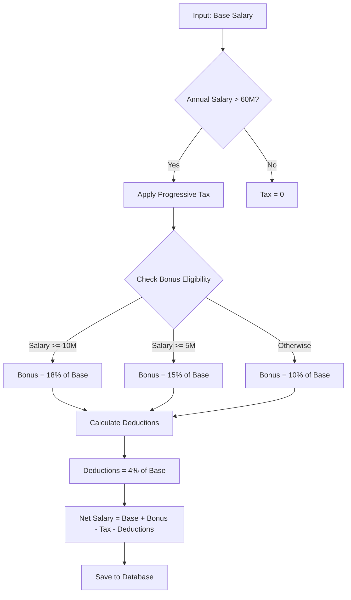
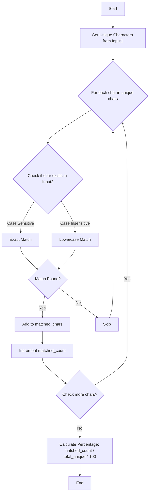

# API Documentation

Base URL: `http://localhost:8081`

## Authentication

Semua endpoint yang memerlukan auth harus menyertakan header:

```
X-API-TOKEN: <token_dari_login>
```

## Error Response Format

```json
{
  "errors": "Error message here"
}
```

## Success Response Format

```json
{
  "data": { ... }
}
```

---

## 1. Auth Endpoints

### Register User

```http
POST /api/users/register
Content-Type: application/json
```

**Request Body:**

| Field | Type | Required | Description |
|-------|------|----------|-------------|
| username | string | Yes | Min 3 chars, max 50 chars |
| password | string | Yes | Min 6 chars |
| name | string | Yes | User's full name |

**Example:**
```json
{
  "username": "admin",
  "password": "admin123",
  "name": "Administrator"
}
```

**Response 201:**
```json
{
  "data": {
    "username": "admin",
    "name": "Administrator"
  }
}
```

### Login

```http
POST /api/users/login
Content-Type: application/json
```

**Request Body:**

| Field | Type | Required |
|-------|------|----------|
| username | string | Yes |
| password | string | Yes |

**Example:**
```json
{
  "username": "admin",
  "password": "admin123"
}
```

**Response 200:**
```json
{
  "data": {
    "username": "admin",
    "name": "Administrator"
  },
  "token": "xxxxxxxx-xxxx-xxxx-xxxx-xxxxxxxxxxxx"
}
```

---

## 2. User Endpoints (Protected)

### Get Current User

```http
GET /api/users/current
X-API-TOKEN: <token>
```

**Response 200:**
```json
{
  "data": {
    "id": 1,
    "username": "admin",
    "name": "Administrator"
  }
}
```

### Update Current User

```http
PATCH /api/users/current
X-API-TOKEN: <token>
Content-Type: application/json
```

**Request Body:**

| Field | Type | Required | Description |
|-------|------|----------|-------------|
| name | string | No | New name |
| password | string | No | New password (min 6 chars) |

**Example:**
```json
{
  "name": "New Name",
  "password": "newpass123"
}
```

**Response 200:**
```json
{
  "data": {
    "id": 1,
    "username": "admin",
    "name": "New Name"
  }
}
```

### Logout

```http
DELETE /api/users/logout
X-API-TOKEN: <token>
```

**Response 200:**
```json
{
  "data": {
    "message": "Logged out successfully"
  }
}
```

---

## 3. Employee CRUD

### Create Employee

```http
POST /api/employees
X-API-TOKEN: <token>
Content-Type: application/json
```

**Request Body:**

| Field | Type | Required | Validation |
|-------|------|----------|------------|
| first_name | string | Yes | Max 100 chars |
| last_name | string | Yes | Max 100 chars |
| email | string | Yes | Valid email format |
| phone | string | Yes | Max 20 chars |
| salary | number | Yes | Must be positive |
| department | string | Yes | Engineering, HR, Sales, Marketing, Operations |
| position | string | Yes | Junior, Senior, Lead, Manager |

**Example:**
```json
{
  "first_name": "John",
  "last_name": "Doe",
  "email": "john@example.com",
  "phone": "081234567890",
  "salary": 15000000,
  "department": "Engineering",
  "position": "Senior"
}
```

**Response 201:**
```json
{
  "data": {
    "id": 1,
    "first_name": "John",
    "last_name": "Doe",
    "email": "john@example.com",
    "phone": "081234567890",
    "salary": 15000000,
    "department": "Engineering",
    "position": "Senior",
    "user_id": 1
  }
}
```

### List Employees

```http
GET /api/employees?page=1&size=10&name=John&department=Engineering
X-API-TOKEN: <token>
```

**Query Parameters:**

| Parameter | Type | Required | Description |
|-----------|------|----------|-------------|
| page | number | No | Default: 1 |
| size | number | No | Default: 10, Max: 100 |
| name | string | No | Search by first_name or last_name |
| department | string | No | Filter by department |

**Response 200:**
```json
{
  "data": [
    {
      "id": 1,
      "first_name": "John",
      "last_name": "Doe",
      "email": "john@example.com",
      "phone": "081234567890",
      "salary": 15000000,
      "department": "Engineering",
      "position": "Senior"
    }
  ],
  "meta": {
    "page": 1,
    "size": 10,
    "total": 1,
    "totalPages": 1
  }
}
```

### Get Employee by ID

```http
GET /api/employees/:id
X-API-TOKEN: <token>
```

**Response 200:**
```json
{
  "data": {
    "id": 1,
    "first_name": "John",
    "last_name": "Doe",
    "email": "john@example.com",
    "phone": "081234567890",
    "salary": 15000000,
    "department": "Engineering",
    "position": "Senior"
  }
}
```

**Response 404:**
```json
{
  "errors": "Employee not found"
}
```

### Update Employee

```http
PATCH /api/employees/:id
X-API-TOKEN: <token>
Content-Type: application/json
```

**Request Body (all fields optional):**

| Field | Type | Description |
|-------|------|-------------|
| first_name | string | Max 100 chars |
| last_name | string | Max 100 chars |
| email | string | Valid email format |
| phone | string | Max 20 chars |
| salary | number | Must be positive |
| department | string | Valid department |
| position | string | Valid position |

**Example:**
```json
{
  "salary": 20000000,
  "position": "Lead"
}
```

**Response 200:**
```json
{
  "data": {
    "id": 1,
    "first_name": "John",
    "last_name": "Doe",
    "email": "john@example.com",
    "phone": "081234567890",
    "salary": 20000000,
    "department": "Engineering",
    "position": "Lead"
  }
}
```

### Delete Employee

```http
DELETE /api/employees/:id
X-API-TOKEN: <token>
```

**Response 200:**
```json
{
  "data": {
    "message": "Employee deleted successfully"
  }
}
```

---

## 4. Salary Calculator

### Calculate Salary

```http
POST /api/salaries/calculate
X-API-TOKEN: <token>
Content-Type: application/json
```

**Request Body:**

| Field | Type | Required | Description |
|-------|------|----------|-------------|
| employee_id | number | Yes | ID of employee |
| period | string | Yes | Format: YYYY-MM (e.g., 2024-01) |

**Example:**
```json
{
  "employee_id": 1,
  "period": "2024-01"
}
```

**Salary Calculation Logic:**



**Calculation Details:**

- **Bonus**: 18% (>=10M), 15% (>=5M), 10% (<5M)
- **Tax**: Progressive based on annual salary
- **Deductions**: 4% of base salary

**Response 200:**
```json
{
  "data": {
    "id": 1,
    "employee_id": 1,
    "base_salary": 15000000,
    "bonus": 2700000,
    "tax": 937500,
    "deductions": 600000,
    "net_salary": 17162500,
    "period": "2024-01"
  }
}
```

### Get Salary History

```http
GET /api/salaries/employee/:employee_id
X-API-TOKEN: <token>
```

**Response 200:**
```json
{
  "data": [
    {
      "id": 1,
      "employee_id": 1,
      "base_salary": 15000000,
      "bonus": 2700000,
      "tax": 937500,
      "deductions": 600000,
      "net_salary": 17162500,
      "period": "2024-01"
    }
  ]
}
```

---

## 5. Character Analysis

### Analyze Character Matching

```http
POST /api/analysis
X-API-TOKEN: <token>
Content-Type: application/json
```

**Request Body:**

| Field | Type | Required | Description |
|-------|------|----------|-------------|
| input1 | string | Yes | First string (max 500 chars) |
| input2 | string | Yes | Second string (max 500 chars) |
| case_type | string | Yes | "sensitive" or "insensitive" |

**Example (Sensitive):**
```json
{
  "input1": "ABBCD",
  "input2": "Gallant Duck",
  "case_type": "sensitive"
}
```

**Response 200 (Sensitive = 20%):**
```json
{
  "data": {
    "id": 1,
    "input1": "ABBCD",
    "input2": "Gallant Duck",
    "case_type": "sensitive",
    "result_percentage": 20,
    "unique_chars": ["A", "B", "C", "D"],
    "matched_chars": ["D"]
  }
}
```

**Example (Insensitive):**
```json
{
  "input1": "ABBCD",
  "input2": "Gallant Duck",
  "case_type": "insensitive"
}
```

**Response 200 (Insensitive = 60%):**
```json
{
  "data": {
    "id": 2,
    "input1": "ABBCD",
    "input2": "Gallant Duck",
    "case_type": "insensitive",
    "result_percentage": 60,
    "unique_chars": ["A", "B", "C", "D"],
    "matched_chars": ["A", "B", "D"]
  }
}
```

### Algorithm Explanation



### Get Analysis History

```http
GET /api/analysis/history
X-API-TOKEN: <token>
```

**Response 200:**
```json
{
  "data": [
    {
      "id": 1,
      "input1": "ABBCD",
      "input2": "Gallant Duck",
      "case_type": "sensitive",
      "result_percentage": 20,
      "unique_chars": ["A", "B", "C", "D"],
      "matched_chars": ["D"]
    },
    {
      "id": 2,
      "input1": "ABBCD",
      "input2": "Gallant Duck",
      "case_type": "insensitive",
      "result_percentage": 60,
      "unique_chars": ["A", "B", "C", "D"],
      "matched_chars": ["A", "B", "D"]
    }
  ]
}
```

---

## Status Codes

| Code | Description |
|------|-------------|
| 200 | Success |
| 201 | Created |
| 400 | Bad Request |
| 401 | Unauthorized |
| 404 | Not Found |
| 500 | Internal Server Error |

---

## Error Responses

**400 Bad Request:**
```json
{
  "errors": "Validation error message"
}
```

**401 Unauthorized:**
```json
{
  "errors": "Invalid or missing token"
}
```

**404 Not Found:**
```json
{
  "errors": "Resource not found"
}
```

**500 Internal Server Error:**
```json
{
  "errors": "Internal server error"
}
```